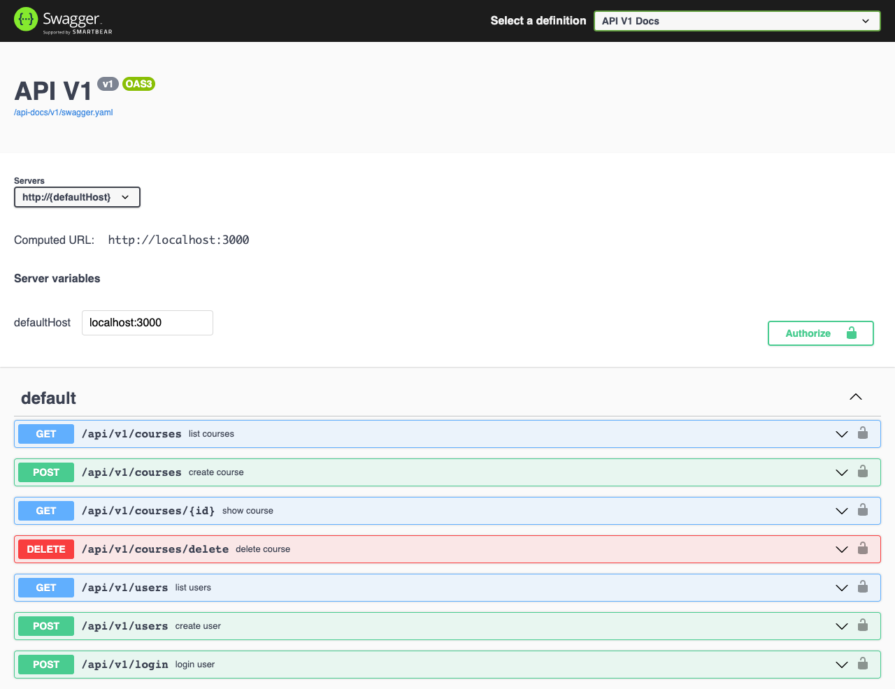
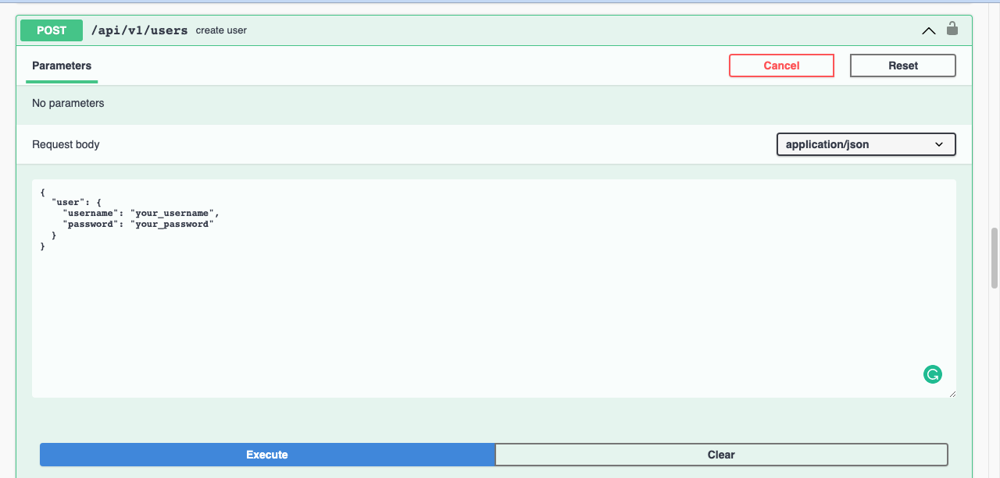
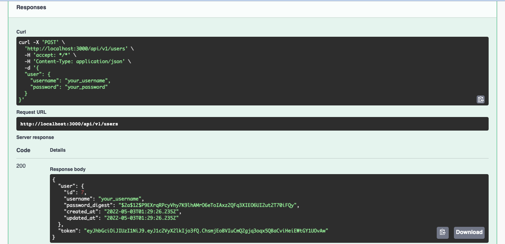
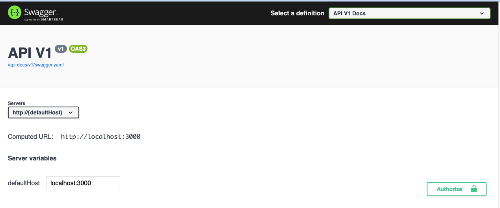
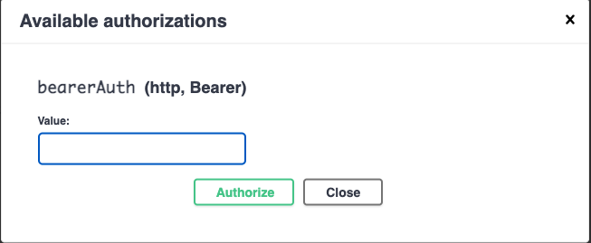
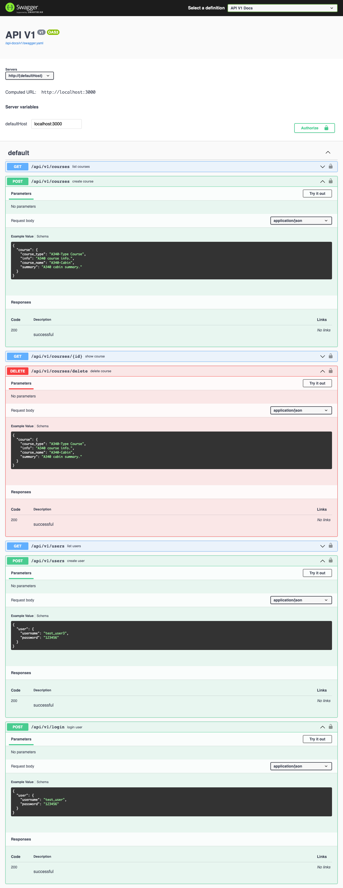

# Rails API for Book Appoinment App

This Rails API is a simple course app with basic functionalities and consists of implementing a Ruby on Rails back-end with JWT Bearer authentication using bcrypt & JWT gems.

Main functionalities are:

- Sign-up/Login users with dedicated endpoints
- Creating/Deleting courses with dedicated endpoints



My learning purpose based on practicing basic authentication with JWT, creating API endpoints to consume it with a separate front end and preparing an automated API documentation with rswag gem.

API documentation is created by using rswag. Documentation use case examples for user sign-ups/logins and adding/deleting of the courses implemented by configuring Swagger-YAML.

## How to use this API

To use all features in your browser by a dedicated API documentation page with a graphical user interface;

- Clone this repository by following these [steps](#Getting-Started).

- Then go to this [link](http://localhost:3000/api-docs).

- You should see the below page in your browser:


> Before requesting any other option, you must create a user with this sign-up endpoint. After clicking to 'Try it Out' button, you can type your username & password right between quote signs and press 'Execute'.



> After creating a user; you will receive a bearer authentication token as a response of this request if your user credentials are correct & valid.

> The response should be like this; if your user is successfully created.



> To learn more about bearer authentication; please check this [ link ](https://swagger.io/docs/specification/authentication/bearer-authentication/).

> Once you got your token, you need to authenticate your by adding it to your requests' header. Copy this token and click to below authenticate button.



> Paste your token to below text box. Press 'Authorize' and close the pop-up menu.



> These are the all endpoints that you can consume after adding your token in your header for each GET/POST/DELETE request.



## Kanban Board

Kanban Board: [Link](https://github.com/yigitm/book-appointment/projects/2)


## Live Demo

React Frontend : [Live Demo Link](https://warm-smakager-3f854a.netlify.app/)

Rails Backend : [Live Demo Link](https://afternoon-ravine-99760.herokuapp.com/api-docs/index.html)

Rails Backend : [Repository Link](https://github.com/yigitm/book-appointment/dev)


## Built With

- Ruby
- Rails
- JWT
- Bcrpyt
- Rspec
- Rswag
- YAML
- Rubocop

## Getting Started

To get a local copy up and running follow these simple example steps.

### Prerequisites

Ruby should be installed in your local machine. Please check this [article](https://www.theodinproject.com/lessons/ruby-installing-ruby) how to install/setup Ruby for different operating systems.

Ruby on Rails should be installed in your local machine. Please check this [article](https://www.theodinproject.com/lessons/ruby-on-rails-installing-rails) how to install/setup Ruby for different operating systems.

### Setup

To get a local copy of the repository please run the following commands on your terminal.

If you are not familiar to use terminal, please check this [article](https://www.theodinproject.com/courses/web-development-101/lessons/command-line-basics-web-development-101)

### Install

Open your terminal & go to your desktop.

```
cd your_desktop
```

Run below commands.

```
git clone https://github.com/yigitm/book-appointment.git
```

### Usage

Go to the app folder.

```
cd book-appointment
```

Run below command to install packages that app is depended to run.

```
bundle install
```

Run below to set database.

```
rails db:create
rails db:migrate
```

Run the local Rails server in your default browser with below command.

```
rails s
```

### Test

RSpec is used for testing. Run below command to run all tests.

```
rspec
```

## Author

👤 **Yigit Mersin**

- GitHub: [@ygtmrsn](https://github.com/ygtmrsn)
- Twitter: [@ygtmrsn](https://twitter.com/ygtmrsn)
- LinkedIn: [yigitmersin](linkedin.com/in/yigitmersin)

## 🤝 Contributing

Contributions, issues, and feature requests are welcome!

Feel free to check the [issues page](https://github.com/yigitm/book-appointment/issues).

## Show your support

Give a ⭐️ if you like this project!

## Acknowledgments

- Microverse
- Open source

## 📝 License

Copyright (c) 2012-2022 Microverse

Permission is hereby granted, free of charge, to any person obtaining
a copy of this software and associated documentation files (the
"Software"), to deal in the Software without restriction, including
without limitation the rights to use, copy, modify, merge, publish,
distribute, sublicense, and/or sell copies of the Software, and to
permit persons to whom the Software is furnished to do so, subject to
the following conditions:

The above copyright notice and this permission notice shall be
included in all copies or substantial portions of the Software.

THE SOFTWARE IS PROVIDED "AS IS", WITHOUT WARRANTY OF ANY KIND,
EXPRESS OR IMPLIED, INCLUDING BUT NOT LIMITED TO THE WARRANTIES OF
MERCHANTABILITY, FITNESS FOR A PARTICULAR PURPOSE AND
NONINFRINGEMENT. IN NO EVENT SHALL THE AUTHORS OR COPYRIGHT HOLDERS BE
LIABLE FOR ANY CLAIM, DAMAGES OR OTHER LIABILITY, WHETHER IN AN ACTION
OF CONTRACT, TORT OR OTHERWISE, ARISING FROM, OUT OF OR IN CONNECTION
WITH THE SOFTWARE OR THE USE OR OTHER DEALINGS IN THE SOFTWARE.
